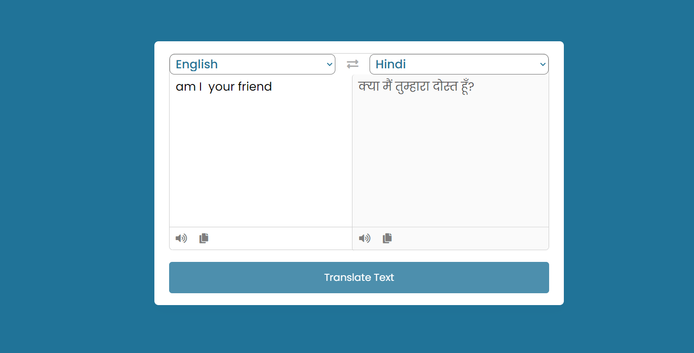

# LANGUAGE TRANSLATOR

### I have made a Language Translator using HTML, Tailwind CSS and JavaScript.

 

 
 

 
## Technology Used:-
  - ` HTML ` 
  - ` Tailwind CSS ` 
  - ` JS ` 
  
 Live Link :- [ Click here ](https://amarjeet-language-translator.netlify.app/)

## It took almost 4 hour to complete.

